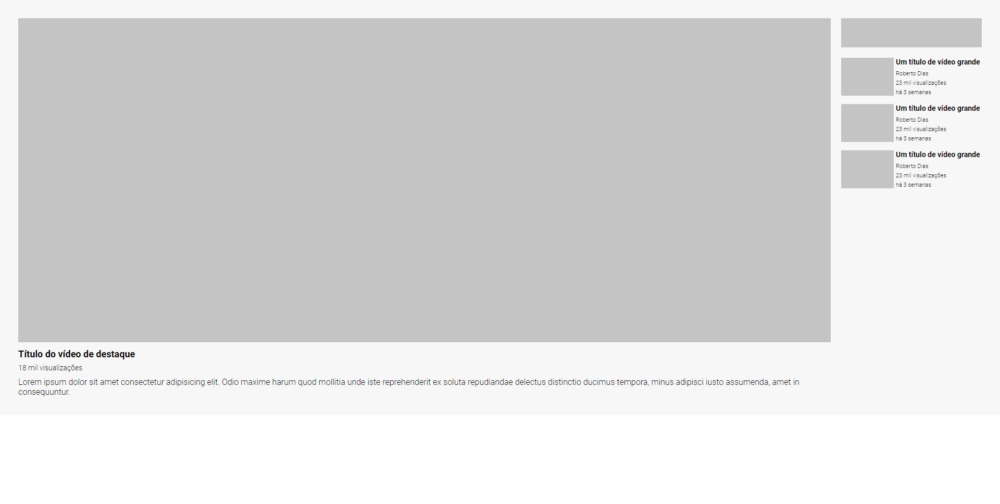

<h1 align="center">
  Layout do YouTube
</h1>

  <a href="https://jonathanbenedito.github.io/layout-youtube" target="_blank">Layout do youtube</a> construído com HTML e CSS usando grid e flexbox para resolução de um exercício.

